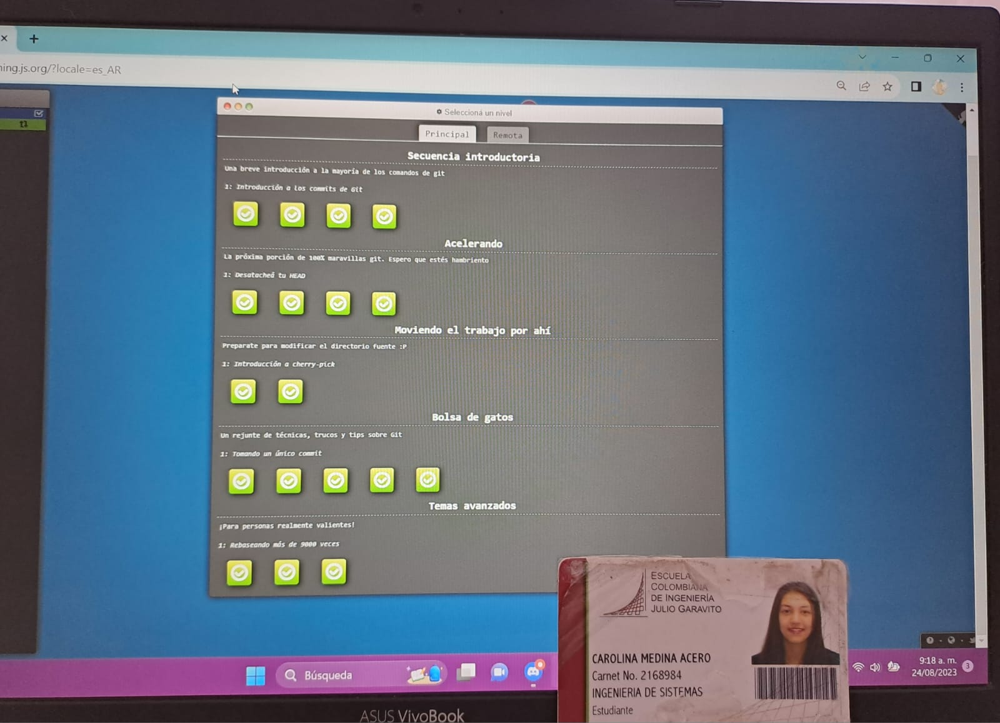

# Soy Carolina Medina Acero

`JOptionPane.showMessageDialog(null, "Bienvenido, este es un espacio para que me conozcas un poquito mejor"); `

## información Importante
    1. Naci el 5 de octubre del 2001
    2. Tengo dos perritos llamados bruno y luna 
 

## Que Me Gusta 
   * Los Dinosarios 
   * Las Manualidades 
   * La calma y la tranquilidad es lo que mas aprecio.  
   * Me gustan los videojuegos y en eso soy algo competitiva.
   * Me gusta mucho la musica en español como las baladas o el rock entre los mas destacados esta Don Tetto, Zoe, The Mills, Sanalejo. Ya en ingles me gusta la musica calmada como the kooks o anbelin.  Aun asi don tetto marco mi etapa del colegio por eso me gusta mucho. 
   

[Link de una canción :D](https://www.youtube.com/watch?v=7ngX0ZFNBDQ)

## Curiosidades 
Empecé con el sueño de ser **ingeniera de sistemas** por un pequeño  *sistema de información* que realice en el Sena cuando estaba en el colegio espero que en esta materia pueda retomarlo y hasta mejorarlo con los conocimientos adquiridos. 

Cuando termine el colegio ayudaba a mis abuelitos en un almacen de telas, por lo que me acostumbre a vender y conocer varios tipos de calidades, es algo en lo que tengo  demasiada experiencia por lo que en algun momento me gustaria aprender a cocer y hacer mi propia ropa. 
    

## Parte3 Del Laboratorio

Me disculpo por presentación del carnet pronto lo cambiare.
 
 

